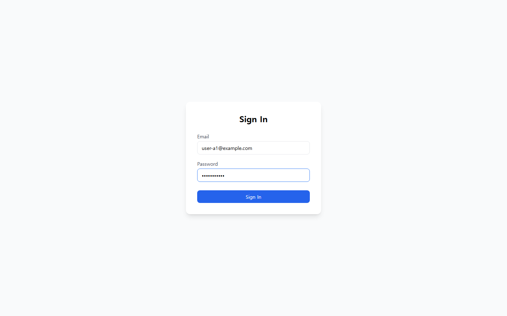
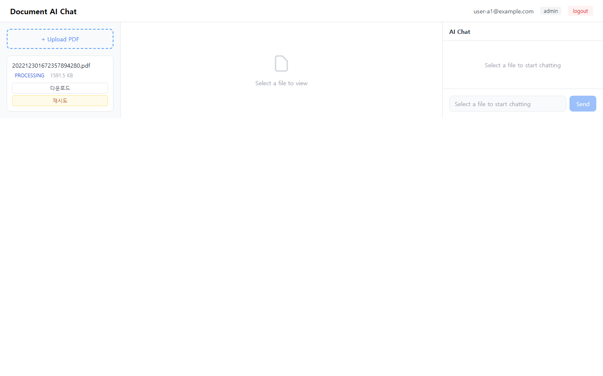
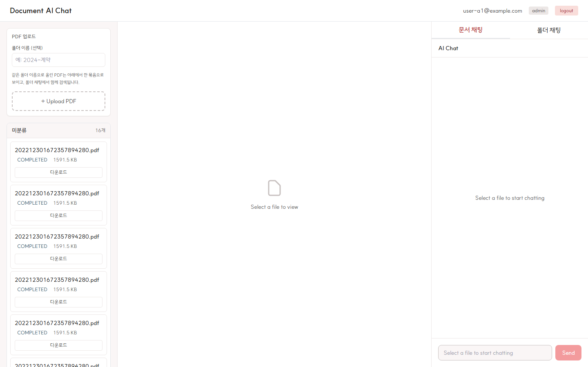
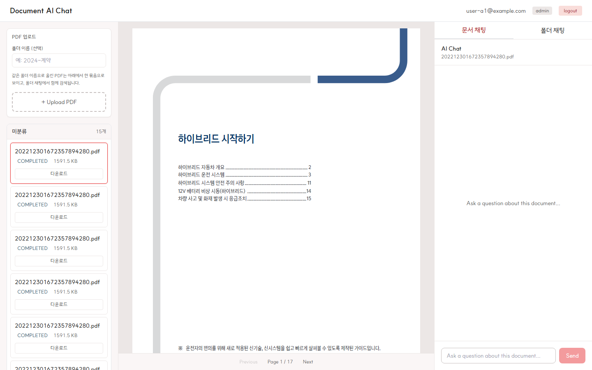
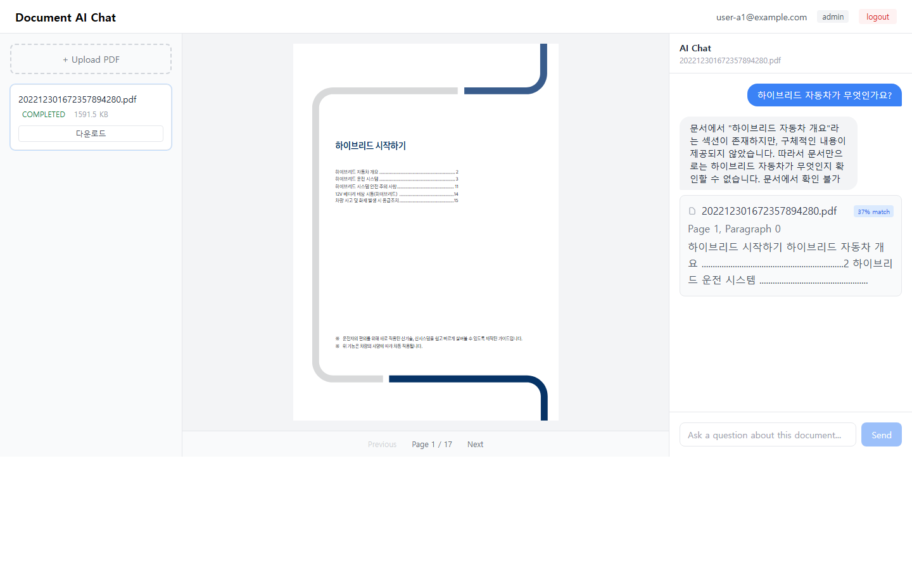
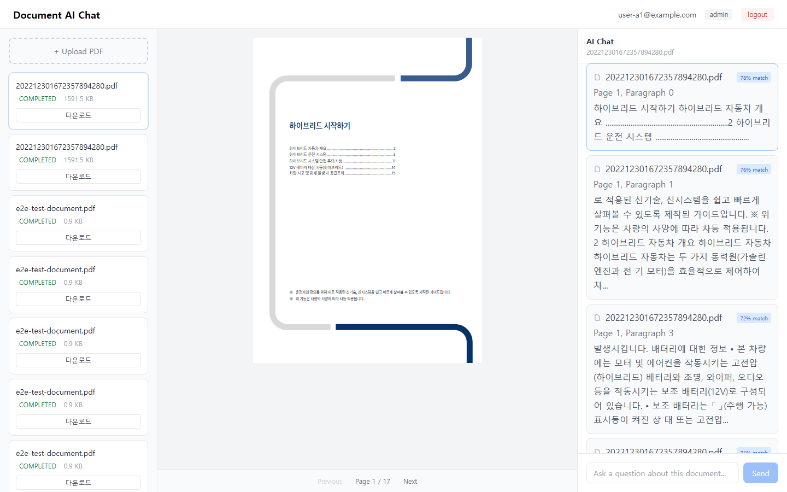
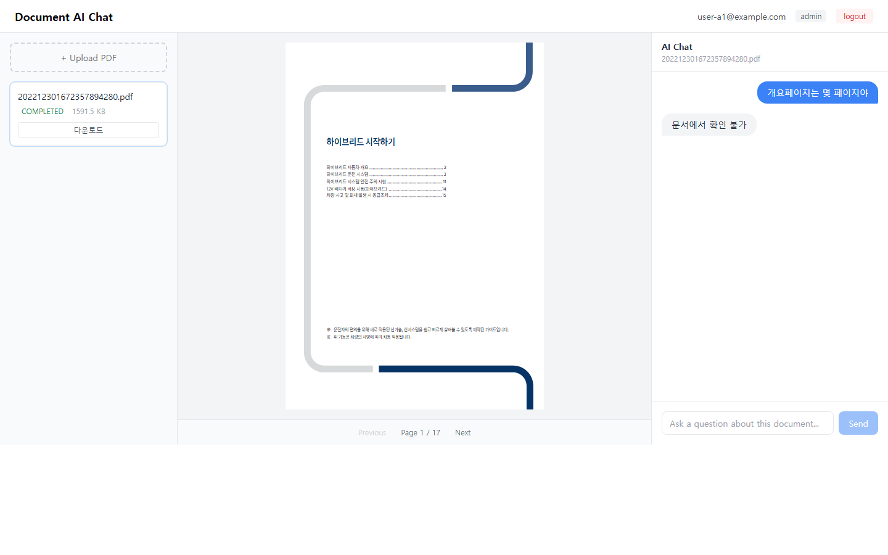
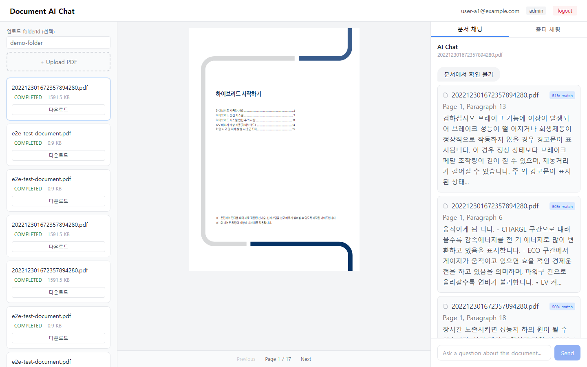
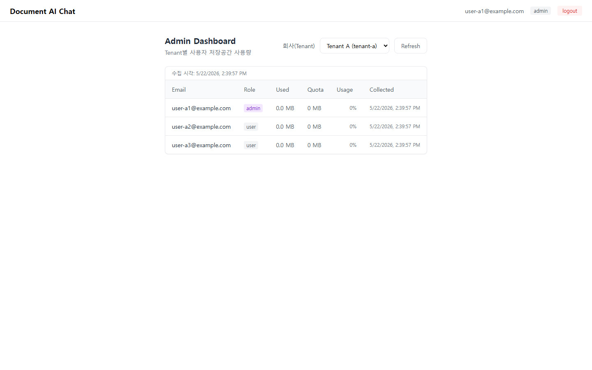

# Document AI Chat - Nextcloud 기반 문서 AI 채팅 시스템

Nextcloud를 파일 저장소로 활용한 멀티테넌트 문서 AI 채팅 시스템. PDF 업로드 → 자동 인덱싱 → RAG 기반 질의응답.

## 목차

- [Quick Start](#quick-start)
- [Demo](#demo)
- [Monorepo 구조](#monorepo-구조)
- [구현 특이사항](#구현-특이사항)
- [아키텍처](#아키텍처)
- [문서](#문서)
- [API Endpoints](#api-endpoints)
- [요구사항 충족 현황](#요구사항-충족-현황)

## Quick Start

```bash
docker compose -f infra/docker-compose.yml up -d
cp .env.template .env   # GEMINI_API_KEY, LLM_API_KEY 등 설정
npx prisma db push --schema=prisma/schema.prisma --config=prisma/prisma.config.ts
npx tsx prisma/seed.ts
npx nx run-many -t serve -p backend frontend
```

- Frontend: http://localhost:4200 (API 프록시 → backend `:3000`)
- Swagger: http://localhost:3000/swagger-doc
- 로그인: `user-a1@example.com` / `password123` ([테스트 계정](./docs/development.md#테스트-계정))

상세 설정·E2E·데모 캡처는 [docs/development.md](./docs/development.md)를 참고하세요.

## Demo

> PDF(`202212301672357894280.pdf`)를 업로드하고 **"하이브리드 자동차가 무엇인가요?"** 라고 질문하는 전체 흐름입니다.

### Screenshots

| #     | 화면                        | 이미지                                                                 |
| ----- | --------------------------- | ---------------------------------------------------------------------- |
| 1     | 로그인                      |                                 |
| 2     | PDF 업로드                  |                           |
| 3     | 인덱싱 완료                 |             |
| 4     | 메인 레이아웃 (PDF 뷰어)    |                     |
| 5-1   | AI 채팅 (RAG 질문·근거)     |       |
| 5-1-1 | 근거 카드 → PDF 페이지 이동 |  |
| 5-2   | AI 채팅 (추가 질문)         |          |
| 6     | 문서에 없는 질문            |               |
| 7     | 관리자 대시보드             |                     |

### Video

GitHub README는 동영상 인라인 재생을 지원하지 않습니다. 아래 썸네일을 클릭하면 저장소의 MP4를 열 수 있습니다.

[](docs/demo-capture.mp4)

[MP4](./docs/demo-capture.mp4) · [WebM](./docs/demo-capture.webm)

스크린샷·동영상 재생성: [docs/development.md — 데모 캡처](./docs/development.md#데모-캡처-스크린샷-자동-생성)

## Monorepo 구조

| 경로 | 설명 |
| ---- | ---- |
| `apps/backend` | NestJS API, RAG, 인덱싱 |
| `apps/frontend` | React + Vite UI |
| `apps/backend-e2e` | API Jest E2E |
| `apps/frontend-e2e` | Playwright (`capture-demo`) |
| `infra/` | Docker Compose (Postgres, Nextcloud) |
| `prisma/` | 스키마·seed |
| `tools/concat-demo-videos.js` | 데모 WebM 합본 + MP4 변환 |

## 구현 특이사항

### API 계약: Nestia + typia

요청·응답 스키마는 **순수 TypeScript `interface`만** 정의하면 됩니다. `class`·`class-validator`·필드별 Swagger 데코레이터 없이, typia tags로 제약만 붙입니다.

```typescript
// apps/backend/src/presentation/auth.dto.ts (발췌)
export namespace AuthDto {
  export interface LoginRequest {
    email: string & tags.Format<'email'>
    password: string & tags.MinLength<1>
  }
}
```

- 컨트롤러는 `@TypedRoute` / `@TypedBody` / `@TypedParam` 등으로 위 타입을 연결합니다.
- Nestia + typia가 **네트워크 입·출력을 런타임 검증**하고, 형식 오류는 일관된 HTTP 4xx로 반환합니다. (`@TypedException`으로 문서화 가능 — [nestia-guide.md](./docs/nestia-guide.md))
- 같은 타입 정의에서 `NestiaSwaggerComposer`가 **OpenAPI(Swagger)를 자동 생성**합니다. (`http://localhost:3000/swagger-doc`, non-production)
- `npx nx run backend:sdk` → `apps/backend/src/api`에 **타입 안전 fetch SDK** 생성. 프론트는 `backend-sdk` alias로 `api.functional.*` 호출 ([`apps/frontend/src/queries/index.ts`](apps/frontend/src/queries/index.ts)). SDK 디렉터리는 `.gitignore` 대상이므로 clone 후 한 번 생성해야 합니다.

### E2E·데모 자동화

| 레이어 | 도구 | 범위 |
| ------ | ---- | ---- |
| API | Jest + axios (`apps/backend-e2e`) | 로그인, tenant 격리, 업로드·인덱싱·RAG·환각 억제, Admin usage, quota 등 **11 시나리오** |
| UI | Playwright (`apps/frontend-e2e`) | 인증·Admin 라우팅 가드, **데모 스크린샷/영상** (`demo-capture` 프로젝트) |

- API E2E는 **코드로 생성한 최소 PDF**를 사용해 외부 샘플 파일 없이 RAG 파이프라인을 검증합니다.
- Playwright `webServer`가 backend 빌드 산출물 + Vite dev 서버를 기동하고, `capture-demo`는 `docs/screenshots/`·`docs/demo-capture.webm`을 갱신합니다. 합본 MP4는 [`tools/concat-demo-videos.js`](tools/concat-demo-videos.js).

### RAG·멀티테넌트

- **pgvector** + Prisma raw SQL, 모든 검색·저장에 `tenant_id` 필터.
- 채팅 응답 optional **`diagnostics`** (`NO_RELEVANT_CHUNKS`, `EMBEDDING_FAILED`, `LLM_API_FAILED`) — UI에서 사용자 메시지로 표시.
- **EmbeddingProvider**: 청크 단위 embedding, 429 재시도·스로틀, OpenRouter 폴백.
- **JwtAuthGuard** / **TenantGuard** / **AdminRoleGuard**로 API·Admin tenant 간 조회 분리.
- Nextcloud/WebDAV·OCS 오류는 stack·자격증명 없이 **고정 HttpException 메시지**로 sanitize.

## 아키텍처

### 전체 구조

```
┌─────────────────────────────────────────────────────────────────────┐
│                         Frontend (React + Vite)                      │
│  ┌──────────┐  ┌──────────────┐  ┌──────────────────────────────┐  │
│  │  Sidebar  │  │  PdfViewer   │  │  ChatPanel / FolderChat      │  │
│  │  파일목록 │  │  react-pdf   │  │  SourceCard(근거)            │  │
│  │  업로드   │  │  페이지이동  │  │  diagnostics 표시          │  │
│  └────┬──────┘  └──────┬───────┘  └──────────────────────────────┘  │
│       └────────────────┼──────────────────────────────────────────┘  │
└────────────────────────┼─────────────────────────────────────────────┘
                         │ HTTP /api (Vite :4200 → proxy :3000)
┌────────────────────────┼─────────────────────────────────────────────┐
│              Backend (NestJS + Nestia)                                │
│  Auth / Files / Admin / Chat / Folder controllers                     │
│  Providers: Nextcloud, PdfWorker, EmbeddingProvider, LlmProvider      │
└────────────────────────┼─────────────────────────────────────────────┘
         │                     │
         ▼                     ▼
   PostgreSQL + pgvector    Nextcloud (WebDAV + OCS)
```

### RAG 파이프라인 (요약)

1. `EmbeddingProvider.generateEmbedding(question)` — Gemini `gemini-embedding-001` (768d), 429 시 재시도·OpenRouter 폴백
2. pgvector 검색 — `WHERE tenant_id` + `document_id` (또는 `folder_id`), similarity ≥ 0.3
3. `LlmProvider.chat` — `.env`의 `LLM_MODEL` / `LLM_BASE_URL`
4. 응답 — `answer`, `sources[]`, optional `diagnostics` (`NO_RELEVANT_CHUNKS`, `EMBEDDING_FAILED`, `LLM_API_FAILED`)

### PDF 인덱싱 (요약)

업로드 → Nextcloud WebDAV → `pdf-parse` → chunk(500/100 overlap) → 청크별 embedding → `COMPLETED`

### 보안 / 권한

- **JwtAuthGuard** + **TenantGuard** (일반 tenant API)
- **AdminRoleGuard** (admin 전용 `/api/admin/*`, tenant 간 usage 조회)
- Vector·DB 쿼리에 `tenant_id` 필터

### 기술 스택

| Category     | Technology |
| ------------ | ---------- |
| Monorepo     | Nx 22.7 |
| Backend      | NestJS 11 + Nestia 11 |
| Frontend     | React 19 + Vite 8 + TailwindCSS 3 |
| Database     | PostgreSQL 16 + pgvector |
| File Storage | Nextcloud (WebDAV + OCS API) |
| Embedding    | Gemini gemini-embedding-001 (768d); optional OpenRouter fallback |
| LLM          | opencode zen / OpenRouter (`LLM_MODEL`, `LLM_BASE_URL`) |
| Auth         | JWT (bcrypt + @nestjs/jwt) |
| State        | jotai + @tanstack/react-query |
| Router       | @tanstack/react-router |
| SDK          | typia + @nestia/core |

## 문서

| 문서 | 설명 |
| ---- | ---- |
| [docs/development.md](./docs/development.md) | 로컬 환경, E2E, 데모 캡처, 벤치마크 |
| [docs/deploy-oracle-cloud.md](./docs/deploy-oracle-cloud.md) | Oracle Cloud 배포 |
| [docs/api-examples.md](./docs/api-examples.md) | API 응답 예시 |
| [docs/logging-policy.md](./docs/logging-policy.md) | 로그·채팅 보관 정책 |
| [docs/requirements-checklist.md](./docs/requirements-checklist.md) | 기능·요구사항 충족 체크리스트 |
| [docs/nestia-guide.md](./docs/nestia-guide.md) | Nestia 가이드 |

## API Endpoints

| Method | Endpoint | Description | Auth |
| ------ | -------- | ----------- | ---- |
| POST | `/api/auth/login` | 로그인 | - |
| GET | `/api/auth/quota` | 저장공간 할당량 | JWT |
| POST | `/api/tenants/:tenantId/files` | PDF 업로드 (`folderId` 선택) | JWT + Tenant |
| GET | `/api/tenants/:tenantId/files` | 파일 목록 | JWT + Tenant |
| GET | `/api/files/:fileId/index-status` | 인덱싱 상태 | JWT |
| POST | `/api/files/:fileId/retry` | 인덱싱 재시도 | JWT |
| GET | `/api/files/:fileId/content` | PDF 스트림 (뷰어) | JWT |
| POST | `/api/files/:fileId/chat` | 문서 RAG (`diagnostics` 선택) | JWT |
| POST | `/api/folders/:folderId/chat` | 폴더 RAG | JWT |
| GET | `/api/admin/tenants` | tenant 목록 | JWT + Admin |
| GET | `/api/admin/tenants/:tenantId/users-usage` | 사용자별 usage + `lastCollectedAt` | JWT + Admin |

Swagger: http://localhost:3000/swagger-doc

## 요구사항 충족 현황

요구사항 체크리스트 전체는 [docs/requirements-checklist.md](./docs/requirements-checklist.md)에서 관리합니다.

- **완료**: 멀티테넌트·Nextcloud·RAG·Admin usage·폴더 RAG·E2E 시나리오 대부분
- **미구현(선택)**: PDF bbox 좌표 추출
- **목표(측정)**: Q&A 10초 이내 — [벤치마크 절차](./docs/development.md#rag-응답-시간-벤치마크)
