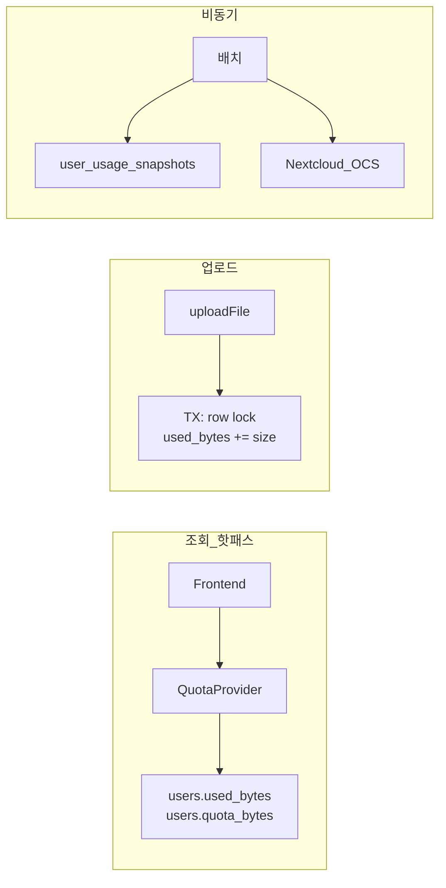

# 쿼터 조회 확장성 가이드 (10만+ 사용자)

이 문서는 **구현 없이** 참고용으로 정리한 설계·안내입니다. 코드 변경 시 단계별로 적용할 수 있습니다.

## 목적

- `GET /api/auth/quota`, Admin `users-usage`가 사용자 수가 늘어날 때 Nextcloud·DB 부하로 실패하지 않도록 한다.
- UI 표시(수초~수분 지연 허용)와 업로드 차단(해당 시점 정확) 요구를 **서로 다른 경로**로 만족한다.

## 현재 동작 (기준 코드)

| 경로                | 구현 위치                           | 요청당 비용                                             |
| ------------------- | ----------------------------------- | ------------------------------------------------------- |
| 사용자 쿼터 조회    | `QuotaProvider.getUserQuota`        | Postgres `SUM(documents.file_size)` + Nextcloud OCS 1회 |
| 업로드 전 검사      | `QuotaProvider.assertUploadAllowed` | 위와 동일 (전체 `getUserQuota` 재호출)                  |
| Admin tenant 사용량 | `AdminProvider.getUsersUsage`       | tenant 사용자 수 N × (aggregate + OCS)                  |

관련 파일:

- [`apps/backend/src/providers/quota.provider.ts`](../apps/backend/src/providers/quota.provider.ts)
- [`apps/backend/src/providers/admin.provider.ts`](../apps/backend/src/providers/admin.provider.ts)
- [`apps/frontend/src/queries/index.ts`](../apps/frontend/src/queries/index.ts) — `useQuota` (기본 `staleTime` 없음)

### 10만+ 가정 시 예상 병목

| 시나리오                      | 문제                                              |
| ----------------------------- | ------------------------------------------------- |
| 동시 1,000명이 quota API 호출 | Nextcloud OCS 1,000회/분, connection pool 고갈    |
| Admin이 tenant 5,000명 조회   | 단일 HTTP에서 OCS 5,000회 → 타임아웃              |
| 업로드 100 rps                | 매 요청 aggregate + OCS                           |
| `documents` 수백만 행         | `owner_user_id` 인덱스 없으면 aggregate 지연 누적 |

### 중요한 관찰

1. **사용량(`usedBytes`)** 은 앱이 업로드·`documents.file_size`를 관리하므로 **앱 DB가 source of truth**이다.
2. **할당량(`quotaBytes`)** 은 Nextcloud OCS에서 읽지만, 데모/요구사항상 사용자별 **100MB 고정**에 가깝다 → 거의 변하지 않는 cold data.
3. Admin API는 `lastCollectedAt`을 내려주지만, 구현은 **요청 시점 실시간 수집**이라 필드 의미와 맞지 않는다.

---

## 설계 원칙: 표시 vs 강제

| 용도                                  | 정확도                | 권장                              |
| ------------------------------------- | --------------------- | --------------------------------- |
| 헤더 `StorageIndicator`, Admin 테이블 | 수초~수분 지연 OK     | 역정규화·스냅샷·캐시              |
| 업로드 `assertUploadAllowed`          | 해당 시점 정확        | DB 카운터 + 트랜잭션 (OCS 불필요) |
| Nextcloud                             | 감사·할당량 변경 반영 | 배치 리컨실만                     |

**실시간과 저비용은 트레이드오프가 아니라 경로를 나누면 둘 다 가능**하다.



---

## 권장 단계 (구현 순서)

### Phase 1 — Postgres 역정규화 (효과 최대, Redis 불필요)

**스키마 (`users`)**

| 컬럼                          | 설명                                  |
| ----------------------------- | ------------------------------------- |
| `used_bytes` BigInt default 0 | 업로드 성공 시 `+= fileSize`          |
| `quota_bytes` BigInt          | 생성/시드 시 1회 설정 (예: 104857600) |
| `quota_synced_at` DateTime?   | 마지막 Nextcloud 동기화               |

**인덱스:** `documents(owner_user_id)` — 백필·리컨실용

**로직 변경 요약**

- `getUserQuota`: `users` PK 1회 조회만 (OCS 제거)
- `assertUploadAllowed` + 업로드: `SELECT … FOR UPDATE` 후 `used_bytes + size <= quota_bytes`, 문서 생성과 카운터 증가를 **한 트랜잭션**
- 기존 데이터: migration 시 `used_bytes = SUM(documents.file_size)` 백필

**효과:** quota 조회 시 Nextcloud 호출 **0**. 읽기 O(1).

**정합성:** 앱이 유일한 쓰기 경로이면 drift는 드묾. 야간 배치로 `used_bytes` vs aggregate 비교 권장.

---

### Phase 2 — Admin 스냅샷 + 페이지네이션

tenant 수천~수만 명은 **실시간 전체 조회가 불필요** (`lastCollectedAt`이 이미 스냅샷 의미).

**테이블 예: `user_usage_snapshots`**

- `user_id`, `tenant_id`, `used_bytes`, `quota_bytes`, `usage_percent`, `collected_at`
- 5~15분 cron (`JobSchedulerProvider` 확장 또는 별도 worker)으로 tenant 단위 bulk 갱신
- `getUsersUsage`: 스냅샷에서 `WHERE tenant_id = ? ORDER BY usage_percent DESC LIMIT/OFFSET`
- UI: 페이지네이션; Refresh = 스냅샷 재조회 (NC 폭주 방지)

---

### Phase 3 — 프론트엔드 부하 완화

[`useQuota`](../apps/frontend/src/queries/index.ts) 권장 설정:

```ts
staleTime: 5 * 60 * 1000,
refetchOnWindowFocus: false,
```

업로드 성공 시 `invalidateQueries(['quota'])` 대신 **optimistic update**로 `usedBytes`만 증가시키면 업로드마다 API 왕복을 줄일 수 있다.

---

### Phase 4 (선택) — Redis

Postgres PK read만으로도 10만 DAU 수준은 대개 충분하다. Redis는 다음 경우에만 검토:

- multi-instance 공유 캐시 (TTL 30~60s)
- user당 quota API rate limit

현재 스택은 Postgres + Nextcloud만 있음 ([`infra/docker-compose.yml`](../infra/docker-compose.yml)).

---

### Phase 5 (선택) — Nextcloud 리컨실

- NC에서 할당량을 수동 변경하면 1일 1회 `quota_bytes` 재동기화
- `used_bytes ≠ SUM(documents.file_size)` drift 알람
- NC 장애 시: 조회·업로드는 DB 값으로 유지, Admin에 「동기화 지연」 표시

---

## Phase 1 적용 후 대략적 처리량

| 항목              | 비고                      |
| ----------------- | ------------------------- |
| `GET /auth/quota` | PK read 수 ms             |
| 업로드 quota 검사 | row lock, OCS 0           |
| Admin 5,000 users | 스냅샷 1쿼리 + pagination |
| 10만 user 백필    | migration 1회             |

---

## 구현 시 손대는 파일 (체크리스트)

| 파일                                                                                                                       | Phase                   |
| -------------------------------------------------------------------------------------------------------------------------- | ----------------------- |
| [`prisma/schema.prisma`](../prisma/schema.prisma)                                                                          | 1, 2                    |
| [`quota.provider.ts`](../apps/backend/src/providers/quota.provider.ts)                                                     | 1                       |
| [`files.provider.ts`](../apps/backend/src/providers/files.provider.ts)                                                     | 1                       |
| [`admin.provider.ts`](../apps/backend/src/providers/admin.provider.ts)                                                     | 2                       |
| [`admin.dto.ts`](../apps/backend/src/presentation/admin.dto.ts)                                                            | 2 (pagination query)    |
| [`job-scheduler.provider.ts`](../apps/backend/src/providers/job-scheduler.provider.ts)                                     | 2                       |
| [`prisma/seed.ts`](../prisma/seed.ts), [`infra/init-nextcloud.sh`](../infra/init-nextcloud.sh)                             | 1 (초기 `quota_bytes`)  |
| [`queries/index.ts`](../apps/frontend/src/queries/index.ts), [`admin-page.tsx`](../apps/frontend/src/pages/admin-page.tsx) | 2, 3                    |
| [`backend.spec.ts`](../apps/backend-e2e/src/backend/backend.spec.ts)                                                       | 1 (DB 카운터 기준 유지) |

---

## 한 줄 요약

**Nextcloud를 조회 핫패스에서 빼고**, `users.used_bytes` / `users.quota_bytes`로 O(1) 읽기·트랜잭션 업로드 검사를 하며, Admin은 스냅샷·페이지네이션으로 N+1 OCS 호출을 없앤다. Redis는 Phase 1~2만으로도 10만 사용자 목표에 보통 충분하다.

## 관련 문서

- [requirements-checklist.md](./requirements-checklist.md) — quota 100MB, Admin usage
- [logging-policy.md](./logging-policy.md) — Nextcloud 오류 sanitize
- [api-examples.md](./api-examples.md) — quota / users-usage 응답 형식
